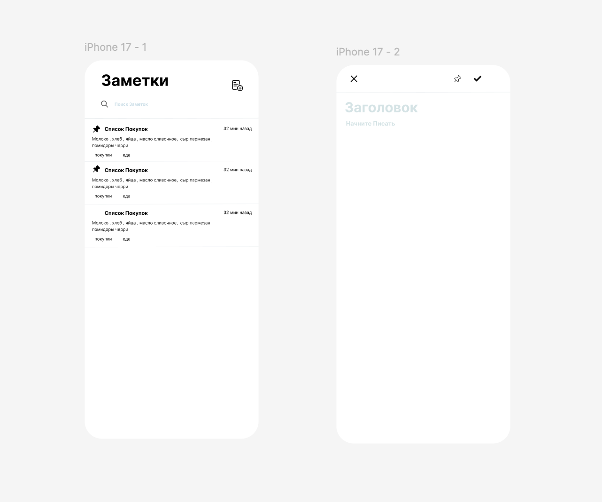

# 📒 NotesApp

NotesApp is a simple and modern iOS application for creating, editing, and managing notes.  
The project was built to practice iOS development, data persistence, and application architecture using native Apple technologies.

---

## 📱 Screenshots



---

## ✨ Features

- Create new notes
- Edit existing notes
- Delete notes
- Save notes locally
- Fast and responsive UI
- Clean and minimal interface
- Dark Mode support

---

## 🏗 Architecture

The application is built using the **MVC (Model-View-Controller)** architecture pattern.

- **Model** — handles data and business logic
- **View** — responsible for the user interface
- **Controller** — manages interaction between Model and View

---

## 🛠 Technologies

- Swift
- UIKit
- CoreData
- UserDefaults

---

## 💾 Data Persistence

- **CoreData** is used for storing notes locally
- **UserDefaults** is used for saving app settings and lightweight data

---

## 🚀 Installation

```bash
git clone https://github.com/vladusbu/NotesApp.git
